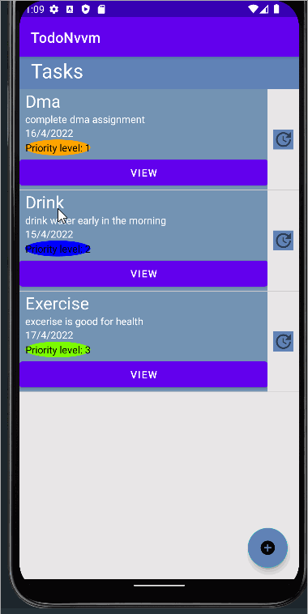

# TodoApp_c7227249

## Todo App

## Splash screen

## Home

task listed below in todo app

## Add Task

## View Task

## Update Task

dma task is updated to ds task

## Delete Task

## Scroll Task

## Add task, ScrollView landscape orientation

